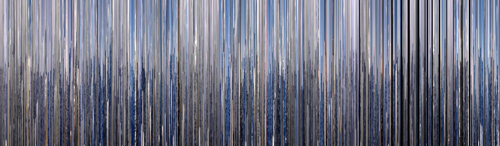
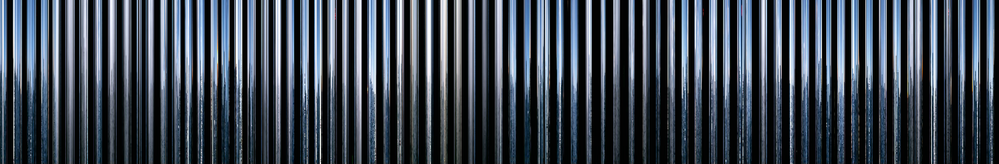

# Buoy Cam Slicer

A tool for visualizing the history of buoy cam images (see [mikewesthad/buoy-cam-scraper](https://github.com/mikewesthad/buoy-cam-scraper)). This takes a single vertical slice from every buoy cam image.

Sketches (click to see full size):

